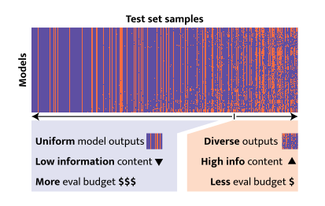

# 🪩 DISCO: Diversifying Sample Condensation for Accelerating Model Evaluation

<!-- [](https://arxiv.org/abs/XXX) -->

<div align="center">
  
</div>

## Overview

This is an implementation of the paper [DISCO: Diversifying Sample Condensation
for Accelerating Model Evaluation](https://arxiv.org/abs/XXX).

Evaluating modern machine learning models has become prohibitively expensive. Benchmarks such as LMMs-Eval and HELM demand thousands of GPU hours per model. Costly evaluation reduces inclusivity, slows the cycle of innovation, and worsens environmental impact.
The typical approach follows two steps. First, select an anchor subset of data. Second, train a mapping from the accuracy on this subset to the final test result. The drawback is that anchor selection depends on clustering, which can be complex and sensitive to design choices. We argue that promoting diversity among samples is not essential; what matters is to select samples that *maximise diversity in model responses*.
Our method, **Diversifying Sample Condensation (DISCO)**, selects the top-k samples with the greatest model disagreements. This uses greedy, sample-wise statistics rather than global clustering. The approach is conceptually simpler. From a theoretical view, inter-model disagreement provides an information-theoretically optimal rule for such greedy selection. **DISCO** shows empirical gains over prior methods, achieving state-of-the-art results in performance prediction across MMLU, Hellaswag, Winogrande, and ARC.

The sections below include: [**Installation**](#installation) for environment setup; [**Reproducing results from the paper**](#reproduce-results-from-the-paper) to generate Table 1 from the paper (no training required, pre-run experiment outputs will be used); [**Download model outputs**](#download-model-outputs) to fetch the data required for training our method; [**Train DISCO**](#train-disco) for training our method and the baselines; [**Notes on `stnd.run_from_csv.py` and `.csv` files**](#note-about-stndrun_from_csvpy-and-csv-files) for details on the experiment runner used to organize the training workflow; and [**Citation**](#citation).

Note: All commands are supposed to be run from the root of this repository and all paths are given relatively to it with occam conda environment activated.

## Table of Contents

- [Overview](#overview)
- [Installation](#installation)
- [Reproduce results from the paper](#reproduce-results-from-the-paper)
- [Download model outputs](#download-model-outputs)
  - [(Optional) Extract model outputs from open-llm-leaderboard data](#optional-extract-model-outputs-from-open-llm-leaderboard-data)
- [Train DISCO](#train-disco)
- [Notes on `stnd.run_from_csv.py` and `.csv` files](#note-about-stndrun_from_csvpy-and-csv-files)
- [Citation](#citation)


## Installation

To create a python environment we use [anaconda](https://www.anaconda.com/).

To create and activate a conda environment with `Python 3.11.7` run the following commands:

```
mkdir -p envs && conda create --prefix ./envs/disco_env python==3.11.7
conda activate ./envs/disco_env/
pip install -r requirements.txt
```

## Reproduce results from the paper

To reproduce the main results from Table 1 please run:

```
python scripts/plot_tables.py --source_config_path ./configs/result_paths/pds_results_suffixes.json
```

It will parse the results from the `results` folder
and print the contents of the Table 1.

If you want to regenerate the results from the `results` folder yourself, you will need to follow the instructions
from the section
["Train DISCO"](#train-disco).

Note: Currently we do not provide code for computing [Metabench](https://arxiv.org/abs/2407.12844) results because the original implementation is written in R and not directly compatible with this repository. The Metabench results used in our paper were computed using the [fork](https://github.com/arubique/metabench) of the original repository. We can add code and commands to reproduce those results by request if there are enough people interested.

## Download model outputs

To train DISCO you will need model outputs on MMLU, Hellaswag, Winogrande and Arc datasets.
To download the outputs (~3GB) please run the following command:

```
python scripts/download_model_outputs.py
```

This script will download the file `data/model_outputs.pickle`.

### (Optional) Extract model outputs from open-llm-leaderboard data

If instead of downloading `data/model_outputs.pickle` you want to generate it from scratch using data from open-llm-leaderboard, run the commands below.
Download a snapshot of the leaderboard used by [tinyBenchmarks](https://arxiv.org/abs/2402.14992), takes ~ 10 hours:

```
python ./scripts/download_leaderboard.py --lb_type openllm_leaderboard --lb_savepath ./data/lb_raw_extended.pickle
```

Download outputs for additional models following tinyBenchmarks, takes ~ 1 hour:
```
python ./scripts/download_leaderboard.py --lb_type mmlu_fields --lb_savepath ./data/lb_raw.pickle
```
Extract outputs from the leaderboard data, takes ~20 min:
```
python scripts/extract_model_outputs_from_raw_data.py
```

Those commands will generate the file `data/model_outputs.pickle`.

## Train DISCO

In this section we train DISCO and baselines on model outputs on MMLU, Hellaswag, Winogrande and Arc.

Make sure that file `data/model_outputs.pickle` exists (see ["Download model outputs"](#download-model-outputs) for details).

To train and evaluate the models run the command below (to better understand the structure of this command see ["Note about stnd.run_from_csv.py and .csv files"](#note-about-stndrun_from_csvpy-and-csv-files)):

```
export ROOT=. && export ENV=$ROOT/envs/disco_env && export PROJECT_ROOT_PROVIDED_FOR_STUNED=$ROOT && conda activate $ENV && python -m stnd.run_from_csv --conda_env $ENV --csv_path $ROOT/sheets/train_eval.csv --run_locally --n_groups 1
```

Upon a successful scripts completion `sheets/train_eval.csv` will look like `sheets/train_eval_filled.csv` and will be ready for the steps described in [Reproduce results from the paper](#reproduce-results-from-the-paper).


## Note about stnd.run_from_csv.py and .csv files

For running exepreiments we use a separate repository [stnd](https://github.com/arubique/stnd). The **stnd** repository contains utility code for running and organizing structured experiments in a reproducible and debuggable way — freeing up mental overhead. It replaces manual bash scripting, log handling, and job submission (e.g., via Slurm) with a streamlined workflow. Once set up, all you need to do to run a new experiment is to specify relevant arguments in a Google Sheet, copy the auto-generated command to the terminal and press Enter. The system handles the rest.

As an output you get Google Sheet or CSV table that you can extend with new experiments later. Each run corresponds to a row containing the run arguments, links to logs and Weights & Biases (if enabled), and any metrics or values the user chooses to store from the script output. All logs by default store full experiment config, python environment, GitHub commit hash, and the associated code diff to make results reproducible.

.csv files are created for compact scripts running. To run the scrips from the .csv file it should be submitted by the commands specified in the relevant sections, such as e.g:

```
export ROOT=. && export ENV=$ROOT/envs/disco_env && export PROJECT_ROOT_PROVIDED_FOR_STUNED=$ROOT && conda activate $ENV && python -m stnd.run_from_csv --conda_env $ENV --csv_path $ROOT/sheets/train_eval.csv --run_locally --n_groups 1
```

### .csv file structure

- Each line of a .csv file corresponds to one run of the script written in the column "path_to_main". If the value of the column "path_to_main" is `__RUNNER__`, then experiment script is specified in the column "delta:exec_path" instead.
- The script from the "path_to_main" column is parametrized by the config file specified in the column "path_to_default_config". If the value of the column "path_to_main" is `__RUNNER__`, then experiment script is parametrized by columns that start with keyword "delta:kwargs/<...>".
- The config from the "path_to_default_config" column is modified by the columns that start with keyword "delta:<...>".

### "n_groups" argument

`--n_groups k` means that `k` lines will be running at a time.

### logs

The logs from running experiment scripts in each row are stored in the `stderr.txt` and `stdout.txt` files inside the folder specified in the "run_folder" column which will be automatically generated after submitting a .csv file.

### "whether_to_run" column

"whether_to_run" column can be modified to select the rows to run. After the .csv file submission only the rows that had `1` in this column are executed.
Whenever a script from some row successfully completes the corresponding value in the column "whether_to_run" changes from `1` to `0`. To rerun the same script 0 should be changed to 1 again.

### "status" column

Immediately after the .csv file submission for the rows that are being run a "status" column will be created (if it does not exist) with the value `Submitted` in it. Once corresponding sripts start running the "status" value will change to `Running`. Once the script completes status will become `Complete`. If the script fails its status will be `Fail`.

If something does not allow the script to start the status can be stuck with `Submitted` value. In that case please check the submission log file which is by default in `tmp/tmp_log_for_run_from_csv.out`.

## Citation

Please cite our paper if you use OCCAM in your work:

```
Coming soon
```
